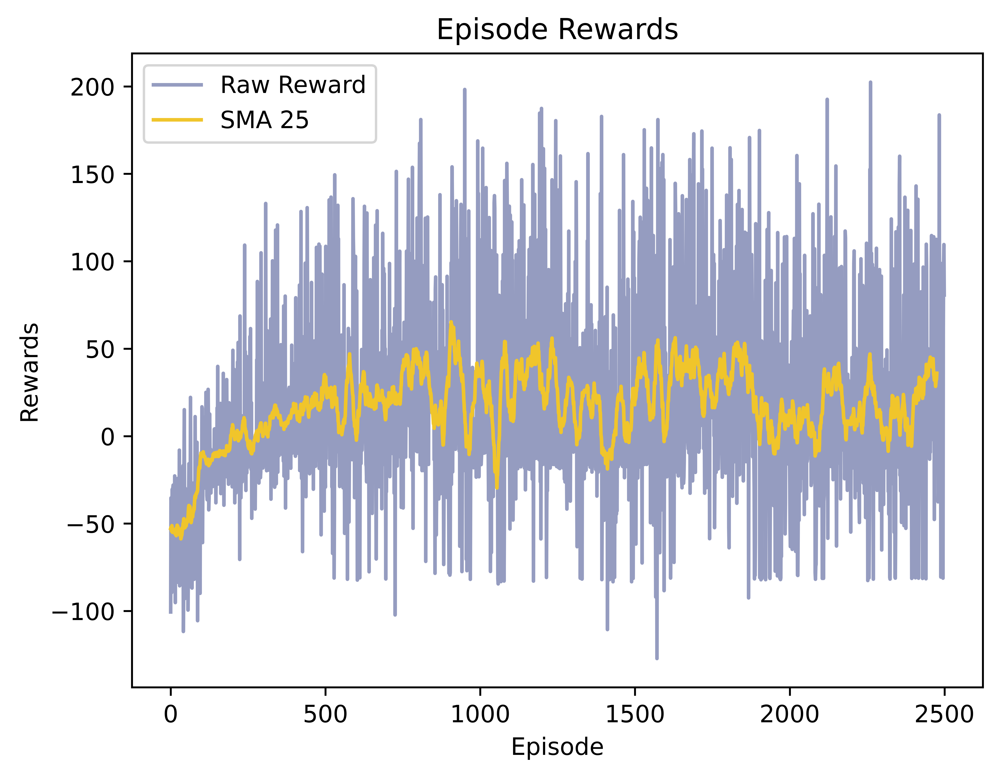

## Description
This repository hosts a Python implementation of the Deep Q-Network (DQN) algorithm, a powerful method within the realm of Deep Reinforcement Learning (DRL). We apply DQN to solve the path planning and obstacle avoidance of a two-wheeled robot in the Webots simulator. The objective is to navigate autonomously through the environment from point A to point B with the [Pioneer 3-DX](https://www.cyberbotics.com/doc/guide/pioneer-3dx?version=cyberbotics:R2019a-rev1) robot without any collisions.. The implementation aims to showcase the effectiveness of DQN in mastering this navigation problem while also serving as a reference for those interested in utilizing and practicing/learning DQN.

## Deep Q-Network (DQN)
The DQN algorithm is a value-based, model-free, and off-policy approach renowned for its capacity to learn optimal policies from high-dimensional input spaces. Originating from the efforts of researchers at DeepMind, DQN merges deep neural networks with traditional Q-learning to approximate the optimal state-action value function (Q function). The major pros and cons of the algorithm are as follows:

###### Advantages:
1. 	**Experience Replay Memory:** By utilizing exploration strategies like the epsilon-greedy policy and employing techniques such as experience replay, DQN significantly enhances sample efficiency and stabilizes the learning process for its main policy. This approach allows the algorithm to learn more effectively from past experiences and facilitates smoother convergence toward optimal policies.

###### Disadvantages:
1. 	**Hyperparameter Sensitivity:** DQN performance relies on tuning many hyperparameters, which makes it challenging to achieve optimal results in different environments.

2. 	**Training Instability:** During training, DQN may encounter instability, primarily originating from the dynamic nature of the target network. Furthermore, performance collapse can occur, presenting a scenario where DQN struggles to recover through learning, potentially hindering its training progress.

## Solution
The main focus of solving the Frozen Lake environment lies in the discrete and integer nature of the observation space. The observation space of the FrozenLake environment consists of a single number from 0 to 15, representing a total of 16 discrete states. To address this, we should encode the state into a one-hot vector. This encoding transforms each discrete observation into a binary vector, where only one element is set to 1, representing the observed state. By doing so, we enable the neural network of the DQN to learn from more features represented by these one-hot vectors rather than solely relying on individual integers. This approach enhances the network's ability to capture the underlying structure of the environment and facilitates more effective learning, ultimately leading to improved performance in navigating the FrozenLake environment.

## Requirements
The code is implemented in Python 3.8.10 and has been tested on Windows 10 without encountering any issues. Below are the non-standard libraries and their corresponding versions used in writing the code:
<pre>
gymnasium==0.29.1
matplotlib==3.5.1
numpy==1.22.0
pygame==2.5.2
torch==2.0.1+cu118
</pre>

**Note:** This repository uses the latest version of Gymnasium for compatibility and optimization purposes. This code does not utilize any deprecated or old versions of the Gym library.

## Usage
For simulation, you need to install [Webots](https://cyberbotics.com) on your system. After installing Webots:

1. Clone the repository.
2. Navigate to the following directory: `./worlds` and open `./worlds/my_world.wbt`
3. Run the simulation and enjoy.
   

The network weights have been pre-saved in the `./controllers/Test/results/final_weights.pt` directory. Therefore, there's no requirement to start training from scratch for testing the code.

## Showcase
you can seet the effectivenss of the model in the followibng gifs. the first gif is test of the path where the robot starts from where its was in the training process, to show the robustness of the model we also added different tests where the robot starts from different position which can be seen in second and third

  
  
  

## Results
The training outcomes for 2 training over 2500 episodes, are summarized below. This includes the raw rewards obtained and the Simple Moving Average of 50 (SMA 50) rewards. we decided to show 2 trainings to make sure that the training process wasn't done randomely and the hyperparametrs and alghoritm is implemented successfully

| first train| second traib|
|:-:|:-:|
